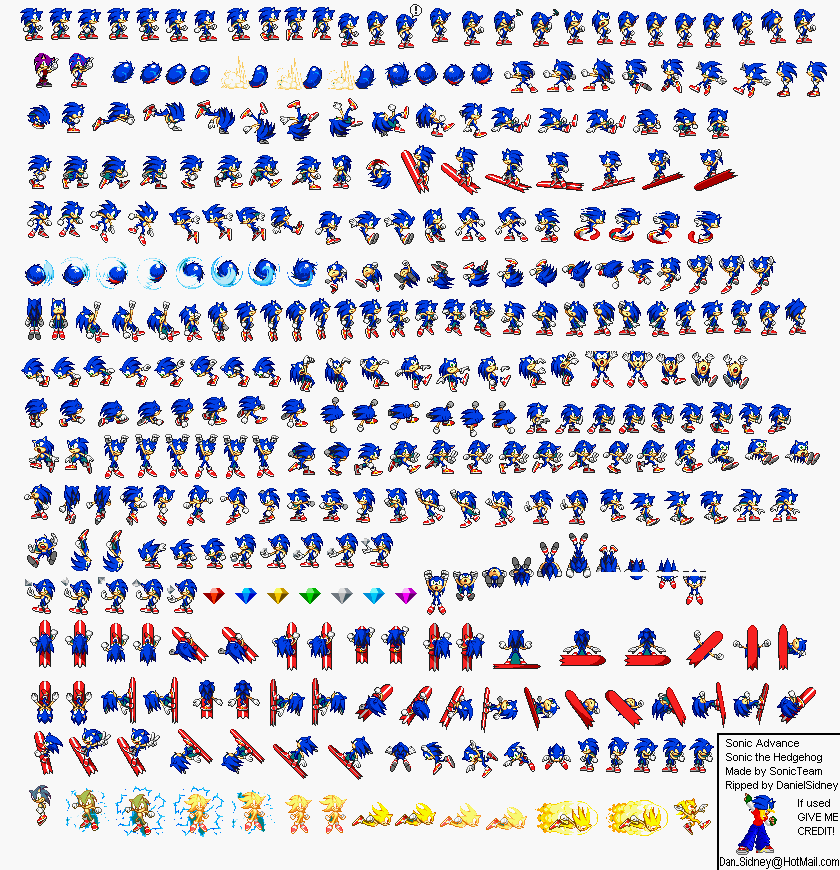
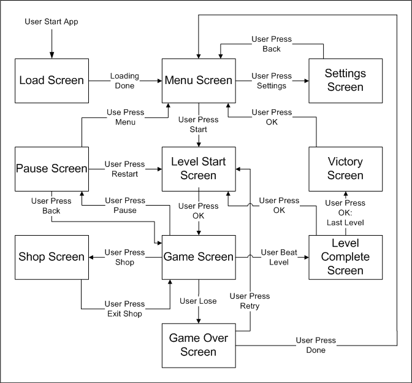

autoscale: true
footer: © New York Code + Design Academy 2015
slidenumbers: true

#[fit] Welcome to <br/>Intro To Game Development
## (aka game from scratch)

---

# Who Is this guy?
- Developer in games for 10 years
- Started off as a tools developer at Electronic Arts, Microsoft and Vanguard Studios


---


# Who Is this guy?
- Worked in game project for education and medicial studies since 2007
- Work at Little Bird Games
- Instructor for New York Development Accademy


---

# Workshop structure
- Working with the Canvas
- Benefits of a graphics package
- The Three Types of Animation
- Basic interaction
- Hit Detection
- State Machines

---

# Software

- Easeljs : suite of visualization, sound and asset loading tools
- Tweenjs : excellent tweening engine
- https://github.com/wlongmire/intro_to_gaming

---

# Other Javascript Gaming Frameworks: 

- http://impactjs.com/
- https://phaser.io/
- http://gamua.com/area-51/

---

# These frameworks tend to focus on 2D gaming experiences and the tools crafted for them.

---

# Where is the play?

---

## Tools learned will work for any quick visualization tool you want to make from scratch.

---

# Working with the Canvas

---

# Working with the Canvas
- Introduced in HTML
- Allows for in browser rendering of 2D shapes and images
- Low level graphics interface. Fast and works with pixels.
- Can be used for 3d rendering using webgl

---

# Working with the Canvas
- Just a rectangle used for graphic rendering
- Can be accessed and styled just like any other html element

---

# Notes on Scalable Vector Graphics [SVG]
- Many data visualization packages are build using SVG
- Vector based, useful for importing/exported file formats
- All objects are saved as DOM objects. 
- Easy traversal and higher level.

---

# Working with the Canvas

```html
<canvas id="myCanvas" width="600" height="200"></canvas>
```

```javascript
<script>

    var canvas = document.getElementById('myCanvas');
    var context = canvas.getContext('2d');

</script>
```

---

# Working with the Canvas

- Contexts allow you to do simple drawing to the canvas

```javascript
<script>

    var canvas = document.getElementById('myCanvas');
    var context = canvas.getContext('2d');

    // do cool things with the context
    context.fillStyle = "green";
    context.fillRect(10,10, 100, 100);

    context.font = '40pt Calibri';
    context.fillStyle = 'blue';
    context.fillText('Hello World!', 150, 100);

</script>
```

---

# Working with the Canvas
## __Reference:__ http://www.w3schools.com/tags/ref_canvas.asp

---

# Using EaselJS

---

# Using EaselJS
## Just one part of the Createjs library

Libraries for sound, preloading assets, and tweening are also available.

---

# Why use EaselJS

- Object based graphics
- Easy hierarchical relationships
- Sprite Sheet integration
- Graphic Filters
- Interaction and touch events

---

# Why use EaselJS

- Object based graphics
- Easy hierarchical relationships
- Sprite Sheet integration
- Graphic Filters
- Interaction and touch events

---

# Using EaselJS

- createjs.stage object points to and controls canvas
- createjs.shape object holds drawn graphics
- craetejs.bitmap object holds images
- createjs.container object holds composite graphic objects
- http://www.createjs.com/docs/easeljs/classes/Graphics.html

---

# The Three Types of Animation
## The Game Loop Tweening, and Sprites

---

# Animating with the Game Loop

---

# Animating with the Game Loop

- A Game loop (or render loop) is a common pattern used in computer graphics.
- A single function at regular intervals.
- Graphic objects are updated according to a speed based on the time between function calls.
- The stage is redrawn.
- Used for user interactions, physics simulations, 

---

# Animating with the Game Loop
- In Easel this is accomplished using the Ticker class.
```javascript
    createjs.Ticker.addEventListener("tick", tick);
    //setup stage and shape object
    //attach to stage
  
    function tick() { 
	shape.x += 1;
	stage.update();
    }

```
---

# Animating with tweens

---
# Animating with tweens
- Allows for pre-set sequences of animations
- Animations are automatically generated over time for any attribute over a given length of time.
- stage updates are handled automatically
- Also requires an implicit use of the Ticker class
- Great for flashy animations that do not require environment interaction (UI, feedback)
- Look at greenback's GSP package when you get a chance.

---

# Animating with tweens

```javascript
    
    //assume circle created and added to stage
    createjs.Tween.get(circle)
          .to({ x: 100 }, 500, createjs.Ease.linear)

    createjs.Ticker.setFPS(60);    
    createjs.Ticker.addEventListener("tick", stage);

```
---

# Animating with tweens

```javascript
    
    //assume circle created and added to stage
    createjs.Tween.get(circle)
          .to({ x: 100 }, 500, createjs.Ease.linear)

    createjs.Ticker.setFPS(60);    
    createjs.Ticker.addEventListener("tick", stage);

```

---

# Animating with sprites

---
# Animating with sprites

- Used for character based 2d animation and pixel art.
- Takes a sequence of static images and shows them in sequence over a length of time.

---

# Animating with sprites



---

# Animating with sprites

http://www.htmlgoodies.com/html5/client/html5-gaming-how-to-animate-sprites-in-canvas-with-easeljs.html#fbid=T8__qj8V36e

---

# Simple Interaction

---

# Simple Interaction
## Mousing object

- Easel Allows for mouse interaction on an object as if it was a dom object

```javascript
stage.enableMouseOver(10);

circle.on("click", function(e){
	console.log("clicked");
});   

```

---

# Simple Interaction
## Mousing The Stage

- You can interact with the stage itself using stagemouse events.
- Make sure to enable mouseover
- Touch available as well.

```javascript
    
        createjs.Touch.enable(stage);
        stage.enableMouseOver(10);
        
        stage.addEventListener("stagemouseup", handleMouseUp);

	function handleMouseUp(event) {
        	// createjs.Tween.get(circle)
	        //   .to({x: stage.mouseX, y: stage.mouseY}, 500, createjs.Ease.bounceOut);
      	}

```

---

# Simple Interaction
## Accessing the mouse

- The current mouse coordinates are always accessible through the stage object

```javascript
    	
        stage.enableMouseOver(10);
	createjs.Ticker.addEventListener("tick", update);
        
	function update(event) {
		circle.x = stage.mouseX;
		circle.y = stage.mouseY;
      	}

```

---

# Simple Interaction
## Keyboard Access

- Can be handled through the document or any other keyboard event interface

```javascript
    	
	this.document.onkeydown = keyPressed;

	function keyPressed(event) {
          switch(event.keyCode) {
            case KEYCODE_LEFT:  
              circle.x -= 5;
              break;
            case KEYCODE_RIGHT: 
              circle.x += 5; 
              break;
            case KEYCODE_UP: 
              circle.y -= 5;
              break;
            case KEYCODE_DOWN: 
              circle.y += 5;
              break;
        }

        stage.update();
      }

```

---

# Hit Detection

---

# Hit detection

- The act of reacting
- Can include making your game react when a mouse is beneath a point or finding out when two objects intersect
- Mostly done on the level of bounding boxes (containers within creates)

---

# Hit detection

- Container.getObjectUnderPoint() returns the top most display object under the specified point.
- Container.getObjectsUnderPoint() returns all display objects under the specified point.
- DisplayObject.hitTest() returns true if the specified point in the display object is non-transparent.
- Box2D

---

# State machines
## make it flow

---

# State machines

- Bringing the feedback of animation, interaction from the user and reaction from collisions together.
- allows you to design feedback from afar.

---

# State machines


---

# State machines



---

# For more:

https://code.tutsplus.com/courses/game-development-with-easeljs

warrenlongmire@gmail.com
@warren_longmire